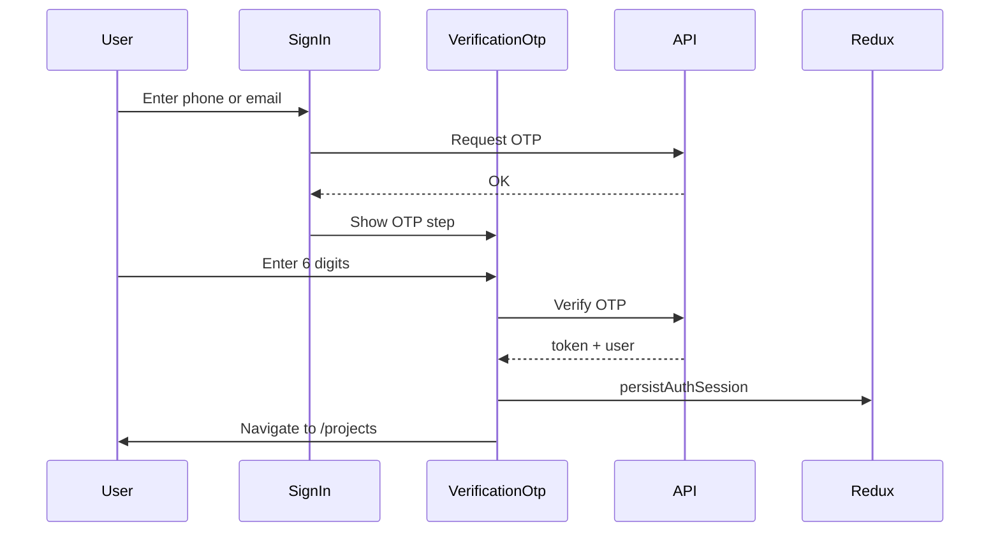

# React-Project-Dashboard-Snippet

> A frontend-only React reference application showcasing OTP authentication, protected routes, and a project management dashboard — built with patterns commonly used in modern production SPAs.

---

## About This Project

This project is a frontend-only React application where users can sign in using a one-time password (OTP) sent via phone or email and access a projects dashboard to view, create, and manage work items across active, backlog, and archived sections.

The application can run locally using a built-in mock API or be connected directly to your own backend services.

The main focus of this project is demonstrating practical single-page application patterns used in real-world frontend development, including secure authentication flows, protected routing, persistent session handling, scalable component architecture, and maintainable API integration patterns.

---

## Table of Contents

1. [About This Project](#about-this-project)
2. [What Problem This Solves (For Developers)](#what-problem-this-solves-for-developers)
3. [What You'll Learn](#what-youll-learn)
4. [Features](#features)
5. [Tech Stack](#tech-stack)
6. [Architecture Overview](#architecture-overview)
7. [Project Structure](#project-structure)
8. [Getting Started](#getting-started)
9. [Environment Variables](#environment-variables)
10. [Local Development (Mock API)](#local-development-mock-api)
11. [Authentication Flow](#authentication-flow)
12. [Routes](#routes)
13. [Available Scripts](#available-scripts)
14. [Testing](#testing)
15. [Security Notes](#security-notes)
16. [Related Documentation](#related-documentation)
17. [Limitations](#limitations)

---

## What Problem This Solves (For Developers)

Building a **client-side React application** that talks to a separate auth/API backend involves the same questions on every project:

| Problem | What this project demonstrates |
|---|---|
| How do I gate pages behind login? | `ProtectedRoute` reads Redux `isLoggedIn` — one source of truth for auth state |
| How do I keep auth in sync after refresh? | `hydrateAuthFromStorage()` seeds Redux from `localStorage` on startup |
| What happens when the API returns 401? | Axios interceptor dispatches `clearAuth()`, clears storage, and redirects to `/auth` |
| Phone and email OTP flows look almost identical — how do I avoid duplication? | Single `VerificationOtp` component with `mode`, `identifier`, and callback props |
| Where should data fetching live vs. UI? | `useProjects` hook owns API calls; the Projects page only renders |
| How do I develop without a running backend? | MSW (Mock Service Worker) intercepts API calls when `VITE_USE_MOCKS=true` |
| How do I structure forms and validation? | Formik + Yup on sign-in; reusable `formElements` primitives |
| How do I handle loading and empty states? | Skeleton components and tabbed project lists (active / backlog / archive) |

This snippet is a **frontend-only SPA**. It does not include a Node/API server — you point it at your own backend or use the built-in mocks for local development. It is intentionally scoped: complete enough to run and extend, small enough to read in one sitting.

---

## What You'll Learn

After working through this codebase, you should understand how to:

- **Separate concerns** — API services (`authService`, `projectService`), Redux for session state, hooks for page-level data (`useProjects`, `useRedirectIfLoggedIn`)
- **Protect routes** with React Router v6 and a wrapper component backed by Redux, not ad-hoc `localStorage` checks in every page
- **Implement OTP sign-in** for both phone and email through one shared verification UI
- **Centralize types** — canonical `Project` interface in `src/types/projectTypes.ts` imported across listing, forms, and details
- **Handle HTTP cross-cutting concerns** — auth header injection and global 401 handling in a single Axios instance
- **Mock APIs locally** with MSW so designers and frontend developers can work without backend dependencies
- **Build for production** — TypeScript strict checking, Vite bundling, lazy-loaded routes, and Vitest unit tests

---

## Features

- **Dual sign-in** — phone OTP or email OTP
- **Session persistence** — token and user profile restored on page reload
- **Protected dashboard** — `/projects` with active, backlog, and archive tabs
- **Project CRUD UI** — add and edit projects via modal form; project detail tabs (support, repo, notes)
- **Reusable UI library** — inputs, buttons, dropdowns, chips, modals, tooltips, skeletons
- **Internationalization** — `react-i18next` with English and Chinese locale files
- **Error boundary** — catches render errors at the app root
- **Toast notifications** — success feedback via `react-toastify`
- **Responsive layout** — Tailwind CSS with viewport hook for mobile/desktop behavior

---

## Tech Stack

| Layer | Technology |
|---|---|
| Framework | React 18 + TypeScript |
| Build tool | Vite 4 |
| Styling | Tailwind CSS |
| State | Redux Toolkit |
| Routing | React Router v6 |
| Forms | Formik + Yup |
| HTTP | Axios |
| i18n | react-i18next |
| Toasts | react-toastify |
| Local API mocks | MSW (development only) |
| Testing | Vitest + React Testing Library |

---

## Architecture Overview

```
┌─────────────────────────────────────────────────────────────┐
│  Browser                                                     │
│  ┌─────────────┐   ┌──────────────┐   ┌─────────────────┐ │
│  │   Pages     │──▶│    Hooks     │──▶│    Services     │ │
│  │ (UI only)   │   │ useProjects  │   │ auth / project  │ │
│  └─────────────┘   │ useRedirect… │   │ / user (Axios)  │ │
│         │          └──────────────┘   └────────┬────────┘ │
│         ▼                                      │          │
│  ┌─────────────┐   ┌──────────────┐           ▼          │
│  │ Components  │   │ Redux store  │    External API     │
│  │ + Protected │◀─▶│ user slice   │    (or MSW mocks)    │
│  │   Route     │   └──────────────┘                       │
│  └─────────────┘                                           │
└─────────────────────────────────────────────────────────────┘
```

### Key design decisions

**Redux as auth source of truth** — `ProtectedRoute` and sign-in redirects read `state.user.isLoggedIn`. `localStorage` is used only for persistence across reloads; `clearAuth()` and the 401 interceptor keep Redux and storage aligned.

**Unified OTP component** — `VerificationOtp` replaces separate email/phone verification screens. Parents (`SigninEmail`, `SigninPhone`) supply API-specific `onVerify` and `onResend` handlers.

**Data hooks over page logic** — `useProjects(userId)` fetches active, backlog, archive, and user options in parallel with `Promise.all`. The Projects page focuses on tabs, modals, and listing UI.

**Thin service layer** — Components and hooks never call `fetch` directly; all HTTP goes through `src/services/` with a shared Axios instance.

---

## Project Structure

```
src/
├── components/
│   ├── auth/
│   │   └── VerificationOtp.tsx    # Shared OTP UI (email + phone)
│   ├── formElements/              # InputField, Button, CustomSelect, etc.
│   ├── includes/                  # Dropdown, Footer, CustomChip, Modal, …
│   ├── Modals/                    # Confirm dialog
│   ├── Projects/                  # Listing, AddProject, detail tabs
│   ├── Skeleton/                  # Loading placeholders
│   ├── Logo.tsx
│   ├── ProtectedRoute.tsx         # Redux-based route guard
│   ├── SigninEmail.tsx
│   ├── SigninPhone.tsx
│   └── ErrorBoundary.tsx
├── hooks/
│   ├── use-projects.ts            # Parallel project + user fetch
│   ├── use-redirect-if-logged-in.ts # Auth pages → /projects when logged in
│   └── use-viewport.ts
├── pages/
│   ├── EmailAuth.tsx
│   ├── PhoneAuth.tsx
│   └── Projects/index.tsx         # Dashboard (rendering only)
├── services/
│   ├── index.ts                   # Axios + Bearer token + 401 handler
│   ├── authService.ts
│   ├── projectService.ts
│   └── userService.ts
├── store/
│   ├── index.ts
│   └── slices/userSlice.ts        # isLoggedIn, userInfo, clearAuth
├── mocks/                         # MSW handlers (dev with VITE_USE_MOCKS)
├── types/
│   └── projectTypes.ts            # Canonical Project, TabName, UserOption
├── utils/
│   ├── authSession.ts             # persistAuthSession, clearAuthSession
│   ├── authStorage.ts             # hydrateAuthFromStorage
│   └── toast.ts
├── translations/                  # en, ch locale JSON
└── tests/                         # Vitest unit tests
```

---

## Getting Started

### Prerequisites

- **Node.js** 18 or later
- **npm** 8 or later

### Setup

```bash
# 1. Navigate to the project
cd existing_snippets/code-snippet-react

# 2. Install dependencies
npm install

# 3. Configure environment
cp .env.example .env

# 4. Start the development server
npm run dev
```

Open the URL printed in the terminal (typically **http://localhost:5173**).

### Production build

```bash
npm run build    # Type-check + Vite production bundle
npm run preview  # Serve the dist/ folder locally
```

---

## Environment Variables

| Variable | Description | Required |
|---|---|---|
| `VITE_BASE_URL_AUTH` | Base URL for auth and project APIs. **Must end with a trailing slash** (e.g. `http://localhost:4000/`). | Yes |
| `VITE_USE_MOCKS` | When `true` in development, MSW intercepts API requests so no backend is required. | No (recommended for local dev) |

Copy `.env.example` to `.env` and adjust values for your environment.

---

## Local Development (Mock API)

With mocks enabled (default in `.env.example`):

```env
VITE_BASE_URL_AUTH=http://localhost:4000/
VITE_USE_MOCKS=true
```

1. Run `npm run dev`.
2. Open **http://localhost:5173**.
3. Sign in with **any** valid phone number or email format.
4. Enter **any 6-digit OTP** (e.g. `123456`).
5. You are redirected to `/projects` with demo data.

MSW only runs when `import.meta.env.DEV` is true and `VITE_USE_MOCKS` is `"true"`. For a real backend, set `VITE_USE_MOCKS=false` and point `VITE_BASE_URL_AUTH` at your API.

---

## Authentication Flow

1. User opens `/auth` (phone) or `/auth/email`.
2. If already logged in, `useRedirectIfLoggedIn` sends them to `/projects`.
3. User submits phone or email → API requests OTP (`authService`).
4. `VerificationOtp` collects the 6-digit code and calls parent `onVerify`.
5. On success, `persistAuthSession` writes token/user to `localStorage` and updates Redux.
6. User lands on `/projects`; `ProtectedRoute` allows access while `isLoggedIn` is true.
7. On **401**, the Axios interceptor clears auth and redirects to `/auth`.
8. On **logout**, `clearAuthSession` clears Redux and `localStorage`.



---

## Routes

| Path | Page | Auth required |
|---|---|---|
| `/` | Redirects to `/auth` | No |
| `/auth` | Phone sign-in | No |
| `/auth/email` | Email sign-in | No |
| `/projects` | Project dashboard | Yes |
| `*` | 404 Not Found | No |

---

## Available Scripts

| Script | Description |
|---|---|
| `npm run dev` | Start Vite dev server with HMR |
| `npm run build` | TypeScript check + production build to `dist/` |
| `npm run preview` | Preview the production build |
| `npm run lint` | Run ESLint |
| `npm run lint:fix` | ESLint with auto-fix |
| `npm test` | Vitest in watch mode |
| `npm run test:run` | Vitest single run (CI-friendly) |

---

## Testing

Unit tests cover shared UI and auth routing:

```bash
npm run test:run
```

Current suites: `Button`, `Logo`, `CustomChip`, `ProtectedRoute` (Redux `Provider` + `isLoggedIn` state).

Vitest disables React Fast Refresh during tests (`fastRefresh: !process.env.VITEST` in `vite.config.ts`) to avoid plugin preamble errors.

---

## Security Notes

| Topic | Current behavior | Production recommendation |
|---|---|---|
| Token storage | JWT in `localStorage` | Prefer `httpOnly` cookies set by the server |
| XSS | Any script on the page can read `localStorage` | Strong Content Security Policy; sanitize inputs |
| 401 handling | Clears client state and redirects | Pair with server-side session invalidation |
| OTP | Demo mocks accept any 6-digit code | Rate-limit and validate OTP server-side |

This snippet prioritizes **clarity and local development** over maximum production hardening. Treat the security table as guidance when adapting the patterns to a real product.

---

## Related Documentation

| Document | Purpose |
|---|---|
| `IMPROVEMENT_PLAN.md` | Prioritized audit: bugs, security, architecture, and refactor checklist |
| `CODEBASE_SCORECARD.md` | Category scores and gap analysis from a staff-engineer review |
| `.env.example` | Environment variable template |

---

## Limitations

- **No backend in this repo** — authentication and project APIs are external; use MSW or your own server.
- **JWT in `localStorage`** — documented trade-off; not ideal for high-security production without changes.
- **Partial test coverage** — core components and `ProtectedRoute` are tested; E2E auth flows are not included.
- **Lint** — some ESLint/Prettier config drift may appear on `src/tests/`; does not block build or dev.

For a full-stack example in this monorepo, see `existing_snippets/code-snippet-nextjs-node-movies`.

---

## License

Private snippet — use and adapt within your organization’s guidelines.
